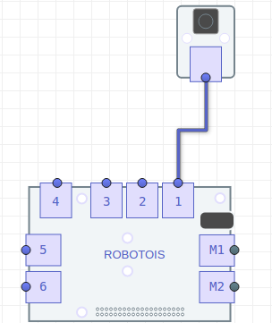

## Instalación
Para instalar el repositorio desde *npm* ejecuta lo siguiente en el *shell*:

```bash
npm install robotois-button
```

Por otro lado es posible instalar la última versión disponible en github para [robotois-button](https://github.com/Robotois/robotois-button). Para esto, se debe utilizar el siguiente commando:

```bash
git clone https://github.com/Robotois/robotois-button.git
```

En este caso, se deben instalar las dependencias de la librería usando `npm install`.

## Conexión al Shield

Es importante considerar que el módulo de botón solo se puede conectar en los puertos `1-6`, ya que los puertos `M1-M2` están designados a módulos de motores. Por ello, para su correcto funcionamiento, se debe especificar el puerto al cuál éste está conectado.

## Ejemplo de conexión del Botón
En la siguiente imágen se observa que el botón se encuentra conectado en el puerto `1` del Shield.



## Inicialización
Con el ejemplo anterior, la inicialización del módulo se realiza de la siguiente manera:

```js
const myButton = require('robotois-button');
const button = new myButton(1);
```

## Obtener estado actual del botón
La función `getValue()` obtiene el estado actual del botón, lo cual retorna el valor `0` y `1`, cuando el botón no está presionado y cuando está presionado, respectivamente.

Un ejemplo básico sería:

```js
setInterval(() => {
  console.log("Estado: " + button.getValue());
}, 100);
```

## Eventos del botón

Esta librería cuenta con un sistema que dispara eventos cuando el estado del botón ha cambiado, es decir, que se disparará un evento cuando el botón ha sido presionado y cuando ha sido liberado. De esta manera se puede ejecutar alguna acción para cada caso. Estos eventos se deben habilitar usando la función `enableEvents()`.

El siguiente ejemplo muestra la manera en que se puede utilizar dicho evento:

```js
button.enableEvents();

button.on('change',(estado) => {
  console.log(`Estado del Botón: ${estado}`);
});
```
