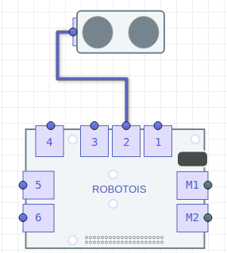

El sensor de Distancia consiste en un sensor **Ultrasonico** *HC-SR04*. Para el cual se utilizan entradas y salidas digitales para obtener las mediciones de distancia. La distancia medida con este sensor está en centímetros y el rango de medición es `3-200cm`.

## Instalación de la librería
Para instalar la librería se tienen dos opcines, una es utilizando el gestor de paquetes **npm** y otra utilizando la herramienta **git** para obtener la ultima version de **GitHub**.

Utilizando **npm** se obtiene la versión estable de esta librería, y para instalar ésta se usa lo siguiente:

```bash
npm install robotois-distance-sensor
```
Por otro lado, es posible instalar la última versión en el repositorio de **GitHub**: [robotois-distance-sensor](https://github.com/Robotois/robotois-distance-sensor). Para ello se debe escribir en la terminal lo siguiente:

```bash
git clone https://github.com/Robotois/robotois-distance-sensor.git
```
Sin embargo, usando **git** es necesario instalar las dependencias, lo cual se realiza ejecutando, en la ruta donde se descargó el repositorio, el siguiente comando  : `npm install`.

## Conexión al Shield
Debido a que el sensor de **Distancia** utiliza puertos de entrada y salida digital, es necesario especificar el puerto al cual éste se encuentra conectado en el **Shield**.



Es importante considerar que los puertos `M1-M2` son dedicados a módulos de **Motores**, por lo tanto solo se pueden utilizar los puertos `1-6`.


## Inicialización
La inicialización del sensor de Distancia se realiza de la siguiente manera:

```javascript
const DSensor = require('robotois-distance-sensor');
const distance = new DSensor(2);
```

## Obtener Valores
Se ha configurado una manera sencilla de obtener mediciones del sensor de Distancia. En donde se disparan eventos para indicar cuándo hay una nueva medición disponible, el objetivo de usar eventos es facilitar las mediciones para tareas sencillas. Otro aspecto relevante es que las mediciones obtenidas serán sin punto decimal, solo enteros. Para habilitar los eventos por medición se utiliza la siguiente función:

```javascript
distance.enableEvents();
```

Un ejemplo de como utilizar los eventos es el siguiente:

```javascript
const DSensor = require('robotois-distance-sensor');
const distance = new DSensor(2);
distance.enableEvents();

distance.on('value', (dist) => {
  console.log(`La distancia es: ${dist} cm`);
});
```

### La función "when"

La función `when` proporciona una forma sencilla de realizar una acción con base en una medición específica. Es decir, que es posible realizar una tarea cuando la distancia medida es de un valor en específico. Por ejemplo:

```javascript
const DSensor = require('robotois-distance-sensor');
const distance = new DSensor(2);

distance.when(15, () => {
  console.log(`Wow, la distancia es: 15 cm`);
});
```
Como se observa, en este código no se hace el llamado de la función `enableEvents()`, ya que ésta se llama de manera implícita cuando se ejecuta la función `when()`.

# Mediciones sin Eventos

Como hemos visto en la sección anterior, las mediciones de Distancia usando eventos porporcionan un punto de inicio para realizar algunas tareas. No obstante, en esta librería se proporcionan las funciones para realizar mediciones de manera directa.


## Función `getValue()`
A diferencia de las mediciones por eventos y usando la función `when()`, la función `getValue()` permite obtener las mediciones de distancia con puntos decimales. Esto en cierta forma puede mejorar la precisión en las mediciones.

Un ejemplo del uso de esta función es el siguiente:

```javascript
const DSensor = require('robotois-distance-sensor');

const distance = new DSensor(5); // Especificar conector

setInterval(() => {
  const dist = distance.getValue();
  console.log(`La distancia es: ${dist}`);
}, 500);
```

El resultado de ejecutar el código anterior es similar al siguiente:

```
La distancia es: 16.70689582824707
La distancia es: 16.267240524291992
La distancia es: 16.439655303955078
La distancia es: 16.732759475708008
```
Como se puede observar, ahora las mediciones tienen una cantidad considerable de dígitos despues del punto decimal, ello debido a la conversión *Análogo-Digital*. Una forma sencilla de obtener mediciones más agradables a la vista, es reducir la cantidad de digitos.

Por lo anterior, en la librería se cuenta con la función `distToString()`, la cual establece un formato de 3 dígitos antes del punto decimal y un dígito después. Con ello se pueden obtener mediciones más adecuadas (para ciertas aplicaciones).

```javascript
const dist = distance.distToString(distance.getValue());
```
En este caso el resultado será similar al siguiente:

```
La distancia es:   7.5
La distancia es:   8.9
La distancia es:   9.8
La distancia es:  10.7
La distancia es:  11.9
La distancia es:  12.9
La distancia es:  13.9
```

## Función `getBasicValue()`
La función `getBasicValue()` permite obtener mediciones sin punto decimal, es decir que solo enteros, de hecho esta función es la que se utiliza en las mediciones con eventos. Por lo tanto, un ejemplo básico de cómo utilizar esta función es tomar el ejemplo anterior y cambiar la función que obtiene la medición:

```javascript
  const dist = distance.getBasicValue();
```
El resultado será similar al siguiente:
```
La distancia es: 4
La distancia es: 6
La distancia es: 9
La distancia es: 12
La distancia es: 16
```
