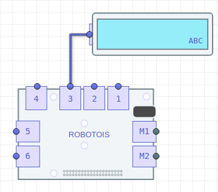

El módulo de Display LCD consiste en una combinación de un módulo de comunicación y control del LCD, y el LCD como tal. Un ejemplo del LCD es el que se muestra en el siguiente [link](https://cdn-shop.adafruit.com/970x728/181-02.jpg). Este Display cuenta un área de 16x2 caracteres, es decir, que se tienen dos renglones con 16 caracteres cada uno.

Este módulo puede ser muy útil para mostrar mensajes que indiquen alguna información relevante en algún proyecto o práctica, o también podría servir para mostrar mensajes de alarma.

El módulo del Display LCD se comunica con el Shield a través del puerto IIC, por lo que en esta librería no es necesario especificar el conector. No obstante en la plataforma Robotois sí es necesario especificar el puerto, ello debido a que se considera que la plataforma está orientada a un nivel de principiante.

## Instalación de la librería

Para instalar esta librería se puede usar el gestor **npm** para obtener la versión estable, o la herramienta **git** para obtener la última versión del repositorio en [GitHub](https://github.com/Robotois/robotois-lcd-display).

Usando **npm** se ejecuta la siguiente línea en la terminal:

```bash
npm install robotois-lcd-display
```

Con la herramienta **git** se debe clonar el repositorio:

```bash
git clone https://github.com/Robotois/robotois-lcd-display.git
```
En este caso, es necesario instalar las dependencias de la librería de manera manual. Por lo que, en el directorio donde se descargó el repositorio (`cd robotois-lcd-display`) se ejecuta lo siguiente:

```bash
npm install
```

## Inicialización


Una vez que el módulo del Display LCD está conectado en uno de los puertos genéricos (`1-6`), la inicialización se realiza de la siguiente manera:

```javascript
const LCD = require('robotois-lcd-display');
const lcd = new LCD();
```

## Mostrar mensajes

### Función `setText()`
Un ejemplo práctico de cómo mostrar mensajes en el Display LCD es el siguiente:

```javascript
const LCD = require('robotois-lcd-display');
const lcd = new LCD();

lcd.setText("Hola mundo!!");

console.log("El mensaje se mostrará por 5 segundos!!");
setTimeout(() => {
  lcd.release();
  console.log("Bye!!");
},5000);
```
En este caso, la función `setText()` se utiliza para mostrar un mensaje estático, ya que éste no cambia durante la ejecución del código. Como se observa, la función `release()` se llama antes de terminar la ejecución del código. Esto se realiza para liberar adecuadamente el Display LCD, ya que se limpia el Display y se apaga la luz de fondo.

No obstante, cuando se tiene un proceso que se ejecuta de manera contínua, y éste termina su ejecución a través de una señal de salida, como `SIGINT` o `SIGTERM`, la librería cuenta con el mecanismo de liberación del Display sin necesidad de llamar la función `release()` de manere explícita.

# Mensajes para Aplicaciones Específicas
En la sección anterior se mostró el uso de la función `setText()`, la cual representa un punto de inicio para usar el Display LCD. Por otro lado, en esta sección se mostrará cómo mostrar mensajes mas personalizados para abordar aplicaciones con diversos escenarios.

## La función `message()`
Esta función sirve para mostrar mensajes pero considerando que no se limpia el contenido actual del Display LCD. Puede parecer contradictorio, pero cuando se tiene información que se está actualizando constantemente puede ser muy útil. Por ejemplo cuando queremos mostrar el valor numérico de algún parámetro relevante:

```javascript
const LCD = require('robotois-lcd-display');

const lcd = new LCD();

let count = 0;

setInterval(() => {
  lcd.message(`Hola, estoy\ncontando: ${count}`);
  count += 1;
}, 500);
```

En este caso el texto que cambia es donde se escribe la variable `count`, y la ventaja de usar `message()` es que no se limpia el contenido del Display para mostrar texto que anteriormente ya tenía éste. Con ello se evita el ligero parpadeo que se produce con `setText()`.

Sin embargo, siendo más estrictos, si en nuestra aplicación se considera que el rango de la variable a mostrar (`count`) es de más de dos dígitos, supongamos `0-999`, entonces se podría establecer un formato más adecuado como el siguiente:

```javascript
const stringCount = (`   ${count.toString()}`).slice(-3);
lcd.message(`Hola, estoy\ncontando: ${stringCount}`);
```
Otro aspecto importante en este ejemplo es que se utiliza el caracter `\n` para indicar que se escriba en una nueva línea, con ello se tiene control de la cantidad de caracteres que se escriben en cada renglón del Display LCD.

### Mensajes por cada renglón
La función `message()` proporciona la habilidad de mostrar mensajes en un renglón específico del Display LCD, tal como se muestra en el siguiente ejemplo:

```javascript
const LCD = require('robotois-lcd-display');

const lcd = new LCD();

lcd.message('Renglon 1', 1);
lcd.message('Renglon 2', 2);

console.log('El mensaje se mostrará por 5 segundos!!');
setTimeout(() => {
  lcd.release();
  console.log('Bye!!');
}, 5000);
```


## Mensajes de alarma
Esta librería cuenta con funciones que permiten indicar algún evento relevante para nuestra aplicación. Esto se realiza a través de la luz de fondo del Display LCD, es decir que ésta se puede encender y apagar repetidamente para indicar un evento de alarma.

Lo anterior se realiza utilizando las funciones `setBacklight()` y  `backlightToggle()`. Con la primer función se puede establecer de manera específica el estado de la luz de fondo, pero con la segunda es posible cambiar el estado actual de ésta sin especificarlo explícitamente, lo cual es bastante útil. El siguiente ejemplo muestra cómo utilizar `backlightToggle()`:

```javascript
const LCD = require('robotois-lcd-display');

const lcd = new LCD();

lcd.message('Hola mundo!!');

setInterval(() => {
  lcd.backlightToggle();
}, 500);
```

Por otro lado, se cuenta con la función `blinkBacklight()`, la cual habilita de manera permanente el parpadeo de la luz de fondo, no obstante este parpadeo puede ser deshabilitado. El siguiente código muestra cómo se podría utilizar esta función:

```javascript
const LCD = require('robotois-lcd-display');

const lcd = new LCD();

lcd.message('Hola mundo!!');

lcd.blinkBacklight(true);

setTimeout(() => {
  lcd.blinkBacklight(false);
}, 5000);

setTimeout(() => {
  lcd.release();
}, 10000);
```
