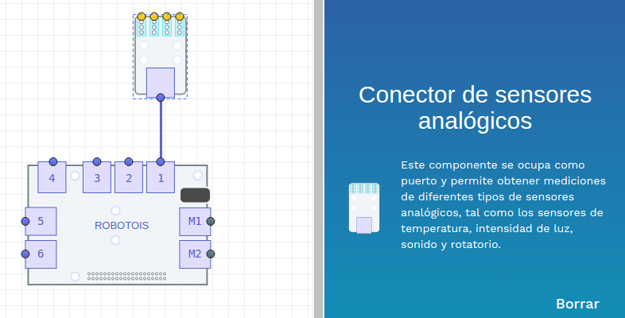
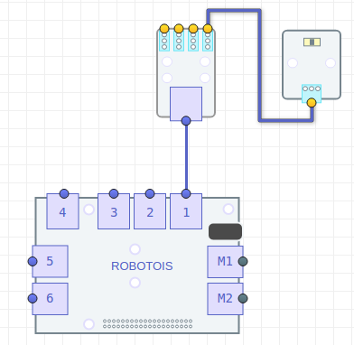

El sensor de Luz es un sensor analógico, el cual proporciona una señal (voltaje) proporcional a la intensidad de luz a la que está expuesto. Este sensor debe usarse en combinación con el módulo de sensores analógicos, ya que éste proporciona el componente (**ADC**, *Analog Digital Converter*) que convierte la señal analógica del sensor en un valor numérico (*Digital*).

Lo anterior es necesario debido a que la **Raspberry PI** no cuenta con un módulo ADC. El módulo de sensores analógicos se comunica con el **Shield** usando el puerto **IIC**, por lo que no es necesario especificar el puerto al cual se conecta. Sin embargo, es importante indicar el puerto analógico al cual se conecta el sensor de Luz.

## Instalación de la Librería

La instalación de la librería se puede realizar de dos maneras:

* La primera es usando el gestor de paquetes [**npm**](https://www.npmjs.com/package/robotois-light-sensor):
```bash
npm install robotois-light-sensor
```

* La segunda opción es clonando la última versión disponible en el repositorio de [**GitHub**](https://github.com/Robotois/robotois-light-sensor):
```bash
git clone https://github.com/Robotois/robotois-light-sensor.git
```
## Conexión al Shield

El primer paso para utilizar el sensor de Luz es conectar el módulo de sensores analógicos. Como se mencionó anteriormente, para este módulo no se requiere especificar el puerto al cual se conecta, ya que utiliza el puerto **IIC**:



Posteriormente se conecta el sensor de Luz al módulo de sensores analógicos. En donde es importante especificar al puerto al cual éste se va a conectar. No obstante, la plataforma Robotois cuenta con la validación requerida para especificar la conexión, pero al utilizar la librería de manera aislada es necesario especificar la conexión manualmente. En la siguiente imágen se muestra un ejemplo de cómo conectar el sensor de Luz:



## Obtener valores
La manera mas sencilla de obtener mediciones del sensor de Luz es utilizando eventos. En esta librería se cuenta con dicho mecanismo, lo cual permite obtener mediciones de Luz en un rango de `0-10`, en donde el valor `0` implica que el sensor detecta poca o nada de luz, y el valor `10` indica que el sensor detecta su máximo de luz. También es importante considerar que las mediciones por eventos se realizan cada `500ms`.

Los eventos de mediciones se habilitan usando la siguiente función:

```javascript
light.enableEvents();
```

Un ejemplo de cómo utilizar los eventos es el siguiente:

```javascript
const LightSensor = require('robotois-light-sensor');

const light = new LightSensor(1);
light.enableEvents();

light.on('medicion', (value) => {
  console.log(`Luz medida: ${value}`);
});
```

El resultado del ejemplo anterior será similar al siguiente:

```
Luz medida: 1
Luz medida: 2
Luz medida: 4
Luz medida: 7
Luz medida: 8
Luz medida: 6
```

## La función `when()`
Esta librería cuenta con la función `when()` la cual permite realizar una acción con base en el valor actual de la luz medida en el sensor. Lo que quiere decir que es posible realizar una acción cuando la luz medida sea de un valor específico. El siguiente ejemplo muestra como utilizar esta función:

```javascript
const LightSensor = require('robotois-light-sensor');

const light = new LightSensor(1);

light.when(3, () => {
  console.log('Wow, la intensidad de luz es 3!!');
});

```
# Mediciones Avanzadas

En la sección anterior se muestran los métodos para obtener mediciones usando eventos y la función `when()`, los cuales representan un punto de inicio para interactuar con el sensor de Luz. Sin embargo, en algunas aplicaciones se requiere tener mediciones más precisas, para ello en esta librería se proporcionan las funciones adecuadas para realizar dicha tarea.

## La función `getValue()`

La función `getValue()` proporciona la capacidad de obtener mediciones con base en la señal analógica que proporciona el sensor de Luz (**TEMT6000**). Es decir que con esta función se obtienen valores numéricos en el rango de `0-5` (valores reales), ya que el voltaje de operación de los módulos es de `5V`. En el siguiente ejemplo se muestra un ejemplo de cómo usar esta función:

```javascript
const LightSensor = require('robotois-light-sensor');

const light = new LightSensor(1);
setInterval(() => { // Proceso en estado ocioso
  console.log(`Luz: ${light.getValue()}`);
}, 1000);

```
El resultado de este ejemplo es similar al siguiente:

```text
Luz: 0.8370000123977661
Luz: 1.7130000591278076
Luz: 3.495000123977661
Luz: 1.7280000448226929
Luz: 1.215000033378601
```

Como se puede observar, en este caso se tiene una cantidad considerable de dígitos después del punto decimal, por ello para ciertas aplicaciones convendría limitar la cantidad de dichos dígitos, por ejemplo:

```javascript
console.log(`Luz: ${light.getValue().toFixed(2)}`);
```

## La función `getBasicValue()`
Con esta función se obtienen mediciones cuyos valores numéricos están en el rango de `0-10` y son valores reales. Se ha incluido esta función en la librería ya que se considera que el rango de valores `0-10` es más intuitivo, ya que el valor `0` indica que se tiene poca o nada de luz y `10` es el valor máximo de luz que puede medir el sensor. Para usar esta función, considerando el ejemplo anterior, puede ser de la siguiente manera:

```javascript
console.log(`BasicValue: ${light.getBasicValue()}`);
```

El resultado de este ejemplo es similar al siguiente (se recomienda usar `toFixed`):

```text
BasicValue: 0.8352941274642944
BasicValue: 2.6235294342041016
BasicValue: 3.1764707565307617
BasicValue: 3.4000000953674316
BasicValue: 4.952941417694092
BasicValue: 6.094117641448975
```

## La función `getScaledValue()`
Esta función obtiene el valor de luz medido por el sensor en un rango de `0-10`, pero en este caso se obtienen valores enteros. De hecho, esta función es utilizada en los métodos para obtener mediciones usando eventos y la función `when()` mostrados en la sección anterior, por lo que cambiando la función para obtener el valor de la medición se obtendrá el mismo resultado.

```javascript
console.log(`ScaledValue: ${light.getScaledValue()}`);
```
