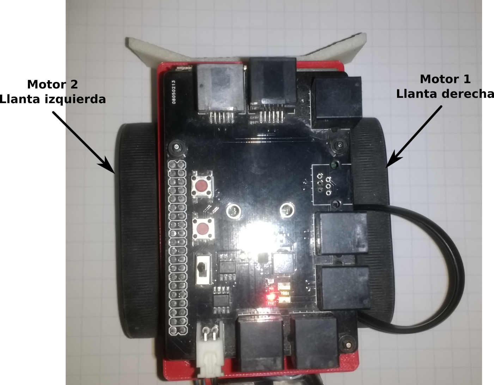

El módulo de motores permite controlar hasta dos motores pequeños. Este módulo es un dispositivo basado en Arduino, ya que contiene un MCU Atmel (*ATmega328*) y un controlador dual para motores (*TB6612*).

Este módulo es uno de los mas avanzados dentro del kit *Robotois*, ya que el MCU se encarga de proporcionar las señales digitales en forma de PWM (*Pulse Width Modulation*) que necesita el driver de motores para funcionar de manera adecuada. Por otro lado, la comucación con la **PI** se realiza a través del puerto **IIC**, por lo que no es necesario especificar el puerto al cual se conecta en el **Shield**, sin embargo, es importante hacer énfasis en que este módulo se debe conectar únicamente en los puertos `M1-M2`, ya que en ellos se tienen las entradas de alimentación (voltaje) para los motores.

La comunicación con el módulo de mótores es bastante simple, porque solo se utilizan funciones genéricas y el MCU se encarga de generar las señales PWM de manera desatendida, es decir que no requiere intervención de la *PI*. Lo anterior nos permite enfocar el desarrollo de proyectos solo en base a si el robot debe moverse hacia adelante o hacia atrás, y con qué velocidad lo debe hacer.

## Instalación de la librería
La instalación de la librería se puede realizar usando el gestor de paquetes **[npm](https://www.npmjs.com/package/robotois-motors)** y a través del repositorio en **[GitHub](https://github.com/Robotois/robotois-motors)**. Para instalar el paquete con **npm** se ejecuta la siguiente línea en el *Shell*:

```bash
npm install robotois-motors
```

Para instalar la última versión disponible en el repositorio de *Github*, se ejecuta lo siguiente:

```bash
npm install git+https://github.com/Robotois/robotois-motors.git
```

## Conexión al Shield y conexión de motores al módulo

La conexión al *Shield* se realiza a través de los puertos `M1` y `M2`, en donde es posible conectar este módulo en cualquiera de dichos puertos. Los motores se conectan al módulo considerando que los conectores de motores tienen el orden que se muestra en la imágen, en donde se observa que, visto desde el ángulo del módulo de motores que está en la imágen, en el lado derecho está el conector del **Motor 1** y el conector del lado izquierdo es para el **Motor 2**.


## Función `motor1PWM()` y `motor2PWM()`
Estas funciones permiten establecer la velocidad con la que se moverán los motores `M1` y `M2` respectivamente. El rango de valores que aceptan estas funciones es de `(-100)-100`, en donde los valores negativos indican que el motor debe moverse en sentido contrario al horario (`Counter Clockwise`), consecuentemente los valores positivos indicarán al motor que se mueva en sentido horario (`Clockwise`). El valor `0` establecerá que el motor se detenga por completo.

Con base en lo anterior, el rango de valores `[-100, 0)` se utiliza para indicar la velocidad del motor para que éste gire en sentido contrario al horario. Es decir que, el valor `-100` es la velocidad máxima y la velocidad mínima se tiene con valores negativos muy cercanos a `0`.

Por otro lado, el rango de valores `(0, 100]` se utilizan para indicar la velocidad a la que se moverá el motor en sentido horario. En donde el valor `100` indica la velocidad máxima del motor en sentido horario y la velocidad mínima se obtendrá con valores positivos muy cercanos a `0`.

Es importante considerar que, aunque las velocidades se especifican con valores numéricos con decimales, internamente éstos se redondean con un dígito después del punto decimal para así obtener apropiadamente la señal digital (*PWM*) en el MCU. El siguiente ejemplo ilustra cómo se utilizan estas funciones:

```javascript
const Motors = require('robotois-motors');

const motors = new Motors();

motors.motor1PWM(50);

setTimeout(() => {
  motors.motor1Stop();
  motors.release();
}, 5000);
```

En este ejemplo se observa que se establece la velocidad del `50%` del máximo para el motor 1, y posteriormente después de 5 segundos se detiene y se libera el módulo.

En el siguiente ejemplo se ilustra un caso de prueba en donde se hacen girar los motores en un sentido y gradualmente se disminuye la velocidad para girar en sentido contrario. De manera específica, la velocidad de los motores iniciará en `-50` (en sentido anti horario), se disminuirá la velocidad hasta llegar a `0` para que posteriormente ésta sea aumentada hasta llegar a `50` (en sentido horario).

```javascript
const Motors = require('robotois-motors');

const motors = new Motors();
let pwm1 = -50;
let sum1 = 5;

let pwm2 = -50;
let sum2 = 5;

setInterval(() => {
  motors.motor1PWM(pwm1);

  if (pwm1 === 50) {
    sum1 = -5;
  }

  if (pwm1 === -50) {
    sum1 = 5;
  }

  pwm1 += sum1;
}, 1000);

setInterval(() => {
  motors.motor2PWM(pwm2);

  if (pwm2 === 50) {
    sum2 = -5;
  }

  if (pwm2 === -50) {
    sum2 = 5;
  }

  pwm2 += sum2;
}, 1000);
```

## La función `motorsPWM()`

Esta función realiza la misma tarea que las funciones `motor1PWM()` y `motor2PWM()` en conjunto. Sin embargo, `motorsPWM()` es mas eficiente en la forma de mandar las instrucciones, ya que ésta envía los valores de las velocidades en una sola transacción (en el puerto **IIC**). Caso contrario de las otras dos funciones, ya que para mandar las instrucciones cada una tiene que iniciar una transacción.

Es probable que en la mayoría de aplicaciones no se vea afectado el rendimiento del módulo de motores, pero para aplicaciones que demanden una gran cantidad de procesamiento por parte de la **PI**, o en donde se use de manera exhaustiva el puerto **IIC**, es más conveniente usar `motorsPWM()`.

En el siguiente ejemplo, se muestra una mejora al ejemplo anterior, en donde se hacía girar los motores en un sentido y luego en otro.

```javascript
const Motors = require('robotois-motors');

const motors = new Motors();

let pwm = -50;
let sum = 5;

setInterval(() => {
  motors.motorsPWM(pwm, pwm);

  if (pwm === 50) {
    sum = -5;
  }

  if (pwm === -50) {
    sum = 5;
  }

  pwm += sum;
}, 1000);
```
Como se observa, se simplifica de manera significativa la manera de establecer las velocidades de ambos motores. Es importante mencionar que el orden en que se especifican las velocidades de los motores es la siguiente `motorsPWM(pwm1, pwm2)`, en donde `pwm1` y `pwm2` son las velocidades de los motores 1 y 2 respectivamente.

## Funciones `motor1Stop()`, `motor2Stop()` y `motorsStop()`

Estas funciones como se puede deducir de sus respectivos nombres, se utilizan para detener el correspondiente motor. Es decir, que se puede detener el movimiento de los motores en cualquier momento. Estas funciones son muy útiles para proyectos como robots de búsqueda, o para evitar cosilisión con algún objeto.

# Uso del Módulo de Motores en Robots
En esta documentación se abordará el caso de un robot con tracción diferencial, es decir, que el movimiento del robot se realiza a través de dos llantas, cada una con su respectivo motor.

En la siguiente imágen se muestra el robot **Robert** que se incluye en el kit **Robotois**, en donde se observa que se tienen dos llantas en forma de oruga, las cuales permiten a *Robert* moverse empleando una tracción diferencial.



En la imágen anterior se indica que el *Motor 1* (del módulo de motores), mueve la llanta derecha, y el *Motor 2* mueve la llanta izquierda. De esta manera, como se puede deducir, para que *Robert* se mueva hacia adelante, la llanta del lado derecho debe girar en sentido horario, y la llanta izquierda debe girar en sentido antihorario.

Con base en lo anterior, para avanzar hacia adelante y considerando que la velocidad de ambos motores debe ser la misma, se deben especificar las velocidades de los motores de la siguiente manera:

* Para el motor derecho la velocidad es positiva.
* Para el motor izquierdo la velocidad debe ser negativa.

Así por ejemplo, supongamos que la velocidad es de `50`, quedaría de la siguiente manera:

```javascript
motors.motorsPWM(50,-50);
```

## `drivePWM(leftPWM, rightPWM)`

La función `motorsPWM()` permite realizar movimientos en *Robert*, no obstante puede resultar confuso al momento de realizar movimientos hacia la izquierda o derecha debido a que se usan valores de velocidad con diferentes signos.

Por lo anterior, en esta librería se incluyó la función `drivePWM()`, la cual encapsula la lógica para hacer mover a *Robert*. En esta función es posible establecer la velocidad de ambos motores, pero considerando que cuando se tienen velocidades positivas `(0, 100]` ambas llantas girarán de manera que *Robert* se mueva hacia adelante, por otro lado cuando las velocidades son negativas `[-100, 0)` *Robert* se moverá hacia atrás. De manera específica, en esta función el primer argumento es para la velocidad del motor izquierdo y el segundo es para la velocidad del motor derecho,

Otra de las virtudes de la tracción diferencial consiste en que *Robert* puede girar hacia la derecha o la izquierda. Esto se realiza cuando existe una diferencia en la velocidad de los motores, para hacer girar a *Robert* se tienen los siguientes escenarios:

* Cuando la diferencia de velocidades en los motores es de tal manera que el motor izquierdo gira a una velocidad menor que el motor derecho, `leftPWM < rightPWM`, entonces *Robert* girará hacia la izquierda.

* Cuando se tiene que la diferencia de velocidades es tal que el motor derecho gira a una velocidad menor que el motor izquierdo `rightPWM < leftPWM`, entonces *Robert* girará hacia la derecha.

Es importante considerar que la velocidad con la que gira hacia la derecha o la izquierda, está determinada principalmente por la diferencia de velocidades, es decir que a mayor diferencia *Robert* girará mas rápido.

## Seguidor de Línea

A continuación se proporciona una versión funcional de un seguidor de línea usando a **Robert**. En esta aplicación, adicionalmente, se utiliza el módulo de **Sensores de Línea** para detectar la línea a seguir. De manera resumida, el algoritmo del seguidor de línea consiste en un control tipo PID, el cual consiste de lo siguiente:

* Se registra la lectura de la línea en cada iteración, usando `line.readLine()`, y se almacena la lectura previa usando las variables `lineReading` y `prevLineReading`. La variable `prevLineReading` es utilizada cuando *Robert* perdió la trayectoria, con lo cual se procede a tomar el último valor de línea registrado. Esto es útil para buscar la trayectoria hacia donde la última vez fue detectada.

* Se calcula el error en la línea, lo cual se realiza con la lectura actual y restando el valor equivalente a cuando la trayectoria se encuentra justo en el centro del módulo de sensores de línea (`200`). De igual manera que en el caso anterior se almacena el error de la iteración anterior para obtener el gradiente del error en la parte proporcional del controlador. La parte integral del error se calcula al realizar la suma acumulada de los errores en cada iteración.

* Posteriormente se calcula la diferencia que debe haber en la velocidad de los motores, la cual se almacena en la variable `powerDifference`. Y por último se establece dicha diferencia de velocidades en el módulo de motores, lo cual se realiza en la línea que contiene lo siguiente: `motors.drivePWM(leftPWM, rightPWM)`.

* Como se puede observar en el código, las iteraciones tienen un tiempo de diferencia de `10 ms`, lo cual se puede considerar que las iteraciones se ejecutan relativamente rápido. Esto se debe a que en este caso el tiempo de respuesta de *Robert* es crucial para que no se salga de la trayectoria.

```javascript
const Motors = require('robotois-motors');
const Line = require('robotois-line-sensors');

const motors = new Motors();
const line = new Line();

function lineFollower() {
  let lineReading, prevLineReading = 0, currentError, prevError = 0, maxPWM = 75,
    currentPWM = 10, leftPWM = currentPWM, rightPWM = currentPWM, kp = 2, ki = 0.0001,
    kd = 5, integral = 0, powerDifference = 0;

  function constrain(value, min, max) {
    if(value < min){
      return min;
    }
    if(value > max){
      return max;
    }
    return value;
  }

  function run() {
    lineReading = line.readLine();
    if (lineReading == -1.0) {
      lineReading = prevLineReading;
    }

    currentError = lineReading - 200;
    prevLineReading = lineReading;

    // PID control
    integral += currentError;
    powerDifference = currentError*kp + integral*ki + (currentError - prevError)*kd;
    prevError = currentError;

    if (powerDifference < 0.0) {
      leftPWM = constrain(currentPWM + powerDifference, 0, 100);
      rightPWM = currentPWM;
    } else {
      leftPWM = currentPWM;
      rightPWM = constrain(currentPWM - powerDifference, 0, 100);
    }

    motors.drivePWM(leftPWM, rightPWM);

    if(currentPWM < maxPWM){
      currentPWM += 0.1;
    }

    setTimeout(run,10);
  }

  run();
}

lineFollower();
```
