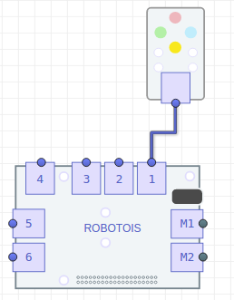

En esta documentación se mostrará cómo utilizar el módulo de LEDs RGB, en donde se presentarán ejemplos prácticos con los cuales se tendrá un panorama general sobre la utilizad de este módulo. Las aplicaciones de este módulo que se consideran relevantes son las siguientes: se puede utilizar como una lampara RGB, con la cual se podría iluminar un área pequeña; un indicador de eventos, en donde se podrían mostrar la ocurrencia de diversos eventos, uno por cada color.

El módulo de LEDs RGB, consiste en un arreglo de LEDs para los cuales puede ser configurado el color a mostrar. Los colores a mostrar serán especificados siguiendo el formato RGB (*Red, Green, Blue*).

# Instalación de la librería
La instalación de la librería se puede realizar de dos maneras, usando el gestor de paquetes [**npm**](https://www.npmjs.com/package/robotois-rgb-leds), y descargando la última versión disponible en [**GitHub**](https://github.com/Robotois/robotois-rgb-leds).

* Usando el gestor **npm**, la instalación se realiza de la siguiente manera:

```shell
npm install robotois-rgb-leds
```

* Para instalar la última versión, se debe descargar el repositorio en **Github** de la siguiente manera:

```shell
git clone https://github.com/Robotois/robotois-rgb-leds.git
```
y posteriormente se deben instalar las dependencias, también es necesario compilar la librería. Lo anterior se realiza ejecutando en consola, dentro del directorio del repositorio recien descargado (`cd robotois-rgb-leds`): `npm install`.

Otra opción para instalar la librería es usar el gestor *npm* para descargar el repositorio:

`npm install git+https://github.com/Robotois/robotois-rgb-leds.git`

Esta opción es la mas recomendada para usar la versión mas actual del repositorio, ya que de manera automática se instala la librería en la carpeta `node_modules` del proyecto.

# Conexión al Shield
El módulo de LEDs RGB se puede conectar a cualquiera de los conectores genéricos del Shield, que son los conectores `1-6`. La comunicación se realiza usando el puerto **IIC**, por ello no es necesario especificar el conector del Shield al cual éste se conecta. No obstante, es importante notar que los conectores `M1-M2` son designados a módulos electromecánicos como motores y servomotores.



# Inicialización de la librería

La inicialización de esta librería es bastante sencilla, y se realiza de la siguiente manera:

```javascript
const RGBs = require('robotois-rgb-leds');
const rgb = new RGBs();
```
Con esto ya es posible hacer uso de las funcionalidades disponibles.

# Funcionalidades de la librería
En esta sección se describen y se dan ejemplos de las funciones con las que se cuenta en esta librería.

## `setRGB()`
La función `setRGB()` permite establecer el color un LED en particular, el color debe ser especificado en formato numérico, con **8 bits** por cada canal de color, es decir que cada canal puede recibir un número en el siguiente rango `0-255`.

A continuación se muestra un ejemplo, en donde se muestra un color específico en el LED número `1`, para probar el funcionamiento de este módulo se recomienda usar la siguiente [página](https://www.w3schools.com/colors/colors_picker.asp) y así tener la referencia del color que se va a mostrar en los LEDs:

```javascript
const RGB = require('robotois-rgb-leds');

const rgb = new RGB();

rgb.setRGB(1, 204, 51, 153);

setTimeout(() => {
  rgb.release();
}, 5000);
```

## `turnOn()` y `turnOff()`
Por otro lado, la función `turnOn()` tiene un funcionamiento similar al de la función `setRGB`, la diferencia radica en que el formato para el color es **Hexadecimal**. Se tiene esta función debido a que el formato *hexadecimal* es ampliamente utilizado y puede ayudar a facilitar el desarrollo de ciertas aplicaciones, de igual forma que en el caso anterior se puede usar como referencia la siguiente [página](https://www.w3schools.com/colors/colors_picker.asp).

Para probar esta función, se puede usar como base el ejemplo anterior:

```javascript
rgb.turnOn(1, '#cc3399');
```
La función `turnOff()` como su nombre lo indica, apaga el led especificado, por ejemplo para apagar el LED `1` sería:  `rgb.turnOff(1);`

## Función `toggle()`
La función `toggle()` cambia el estado actual del LED especificado, es decir, que si éste se encuentra apagado, lo enciende; pero si el LED está encendido, lo apaga. El parámetro que recibe esta función es el color RGB en *hexadecimal* que tendrá el LED. Un ejemplo práctico sería el siguiente:

```javascript
const RGB = require('robotois-rgb-leds');

const rgb = new RGB();

setInterval(() => {
  rgb.toggle(1, `#${Math.floor(Math.random() * 16777215).toString(16)}`);
  rgb.toggle(2, `#${Math.floor(Math.random() * 16777215).toString(16)}`);
  rgb.toggle(3, `#${Math.floor(Math.random() * 16777215).toString(16)}`);
  rgb.toggle(4, `#${Math.floor(Math.random() * 16777215).toString(16)}`);
}, 500);
```

En este ejemplo se encienden y apagan todos los LEDs, como se observa se establece el color de los LEDs de manera aleatoria, y cada uno de ellos tiene un color diferente.

## `blink()` y `blinkOff()`

Esta función permite habilitar el parpadeo contínuo de un LED en específico, en donde el color se debe especificar en *hexadecimal*. Esta función opera de manera desatendida, es decir, que se puede dejar el LED en modo parpadeo de manera indefinida. No obstante, para apagar o eliminar el parpadeo del LED se usa la función `blinkOff()`.

El siguiente ejemplo muestra como se podría utilizar esta función:

```javascript
const RGB = require('robotois-rgb-leds');

const rgb = new RGB();

rgb.blink(1, `#${Math.floor(Math.random() * 16777215).toString(16)}`);

setTimeout(() => {
  rgb.blinkOff(1);
}, 5000);

setTimeout(() => {
  rgb.release();
}, 8000);

```

## Funciones `allOn()` y `allOff()`
Estas funciones nos sirven para establecer el estado de todos los LEDs que se encuentran en el módulo. Con `allOn()` se establece el color que mostrarán todos los LEDs, el color se debe especificar en *hexadecimal*. Por otro lado, la función `allOff()` se utiliza para apagar todos los LEDs de manera inmediata.

Es importante notar que, aunque es posible obtener el mismo resultado usando las funciones `turnOn` y `turnOff`, las funciones `allOn` y `allOff` operan de manera diferente, ya que de manera interna se manda la instrucción para el IC del módulo de apagar todos o encender todos, sin tener que hacerlo un LED a la vez.

En el siguiente ejemplo se muestra cómo podrían utilizarse estas funciones:

```javascript
const RGB = require('robotois-rgb-leds');

const rgb = new RGB();

rgb.allOn('#cc3399');

setTimeout(() => {
  rgb.allOff();
}, 5000);

setTimeout(() => {
  rgb.release();
}, 8000);
```

## `allToggle()`
Esta función permite encender y apagar todos los LEDs al mismo tiempo, es decir, que si los LEDs están encendidos éstos se apgarán, pero si los LEDs están apagados se encenderán. En este caso el color se especifica en formato *hexadecimal*. El siguiente ejemplo muestra como podría utilizarse esta función:

```javascript
const RGB = require('../index');

const rgb = new RGB();

setInterval(() => {
  rgb.allToggle(`#${Math.floor(Math.random() * 16777215).toString(16)}`);
}, 500);
```

## Funciones `allBlink()` y `allBlinkOff()`
Estas funciones, como se puede deducir, permiten establecer que todos los LEDs parpadeen y que se elimine dicho parpadeo. Como es natural, se debe especificar el color que tendrán los LEDs en formato *hexadecimal*. Para comprender de manera más práctica estas funciones, se muestra un ejemplo a continuación:

```javascript
const RGB = require('../index');

const rgb = new RGB();

rgb.allBlink(`#${Math.floor(Math.random() * 16777215).toString(16)}`);

setTimeout(() => {
  rgb.allBlinkOff(1);
}, 5000);

setTimeout(() => {
  rgb.release();
}, 8000);
```

El parpadeo de todos LEDs se puede dejar desatendido, es decir que puede ejecutarse de manera indefinida, y con la función `allBlinkOff()` se puede detener dicho parpadeo.
