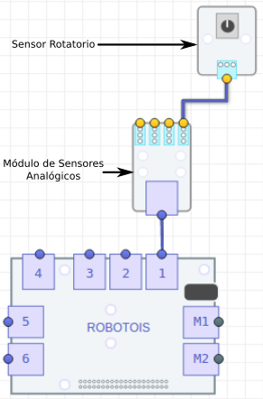

El Sensor Rotatorio es un sensor analógico, es decir que éste proporciona una señal (voltaje) proporcional a la posición a la que se encuentra la perilla. Por lo anterior, este módulo debe usarse en combinación con el módulo de Sensores Analógicos, ya que éste cuenta con el componente **ADC** (*Analog Digital Converter*), y a través de éste se obtienen mediciones numéricas.

Es bien sabido que la *Raspberry PI* no cuenta con módulos ADC, por ello es importante usar el módulo de Sensores Analógicos. La comunicación del módulo de Sensores Analógicos con la PI se realiza a través del puerto **IIC**, por lo cual no es necesario especificar el puerto del **Shield** al cual se conecta. Sin embargo, solo se pueden usar los puertos genéricos `1-6`, ya que los puertos `M1-M2` son designados para motores.

Por otro lado, para el Sensor Rotatorio se debe especificar a cuál puerto analógico (del módulo de Sensores Analógicos) se va a conectar, ya que este parámetro es requerido para tomar las mediciones adecuadamente.

## Instalación de la librería

Al igual que todas las librerías de **Robotois**, esta librería se puede instalar a través del paquete en [**npm**](https://www.npmjs.com/package/robotois-rotary-sensor) o el repositorio de [**GitHub**](https://github.com/Robotois/robotois-rotary-sensor):

* Usando el gestor **npm** la librería se instala de la siguiente manera:
```bash
npm install --save https://github.com/Robotois/robotois-rotary-sensor.git
```

* Para instalar desde el repositorio de **GitHub**, se puede descargar el repositorio, pero se recomienda lo siguiente:
```bash
npm install --save git+https://github.com/Robotois/robotois-rotary-sensor.git
```

## Conexión al Shield
La conexión al **Shield** se realiza como se ilustra en la siguiente imagen, en donde se observa que el Sensor Rotatorio se conecta en uno de los puertos analógicos del Módulo de Sensores Analógicos y éste a su vez se conecta al Shield en uno de los puertos genéricos.



## Obtener mediciones
Con esta librería se pueden obtener las mediciones del Sensor Rotatorio de manera sencilla, en la cual se utilizan eventos. Es decir, que cada vez que está disponible una medición nueva, se dispara un evento con un valor proporcional a la posición que se encuentra la perilla del Sensor Rotatorio. En este caso, los valores de las mediciones están en un rango de `0-10`, en donde el valor `0` indica que la perilla se encuentra en la posición más baja y el valor `10` indica que la perilla se encuentra en la posición máxima.

Otros aspectos importantes de la medición por eventos son los siguientes, las valores numéricos son valores enteros y el tiempo de muestreo es de `250ms`. Se debe tener en consideración esta información, ya que si la aplicación que se va a desarrollar requiere de un mejor tiempo de muestreo o se requieren mediciones más precisas, entonces probablemente es mejor usar otro de los métodos de los que cuenta esta librería, para obtener las mediciones.

Un ejemplo de cómo utilizar las mediciones por eventos es el siguiente:

```javascript
const RotarySensor = require('robotois-rotary-sensor');

const rotary = new RotarySensor(1);

rotary.enableEvents();

rotary.on('medicion', (value) => {
  console.log(`Posicion: ${value}`);
});
```
En el ejemplo anterior, se observa que para habilitar las mediciones por eventos se debe ejecutar la función `enableEvents()`. El resultado de ejecutar el ejemplo anterior, puede ser el siguiente:

```text
Posicion: 0
Posicion: 2
Posicion: 4
Posicion: 5
Posicion: 7
Posicion: 9
Posicion: 10
Posicion: 10
Posicion: 10
Posicion: 7
Posicion: 5
Posicion: 4
Posicion: 2
Posicion: 2
Posicion: 1
Posicion: 0
```

Como se puede observar, en el resultado anterior se tienen los valores de las mediciones cuando se hace girar la perilla del Sensor Rotatorio de la posición mínima a la posición máxima, y viceversa.

## Función `when()`

También se cuenta con la función `when()`, la cual permite realizar una acción con base en la posición actual de la perilla del Sensor Rotatorio. Lo que quiere decir que es posible programar una tarea para cuando la perilla se encuentra en una posición específica. En el siguiente ejemplo se muestra cómo utilizar esta función:

```javascript
const RotarySensor = require('robotois-rotary-sensor');

const rotary = new RotarySensor(1);

rotary.when(5, () => {
  console.log('Wow, la posicion es 5!!');
});
```
Como se observa, en el ejemplo anterior no es necesario ejecutar explíticamente la función `enableEvents()`, ya que de manera interna, en la función `when()` se realiza dicha invocación. El resultado de ejecutar el ejemplo anterior se muestra a continuación.

```text
Posicion: 0
Posicion: 1
Posicion: 2
Posicion: 4
Posicion: 4
Posicion: 5
Wow, la posicion es 5!!
Posicion: 5
Wow, la posicion es 5!!
Posicion: 5
Wow, la posicion es 5!!
Posicion: 6
Posicion: 7
Posicion: 8
```

# Mediciones Avanzadas

En esta sección se abordan otros métodos para obtener mediciones del Sensor Rotatorio. El método de medición por eventos y usando la función `when()` se pueden llegar a considerar como un punto de inicio, ya que para ciertas aplicaciones se requiere obtener mediciones más precisas y/o con un menor tiempo de muestreo, lo que implica un mejor tiempo de respuesta.

## Función `getValue()`

La función `getValue()` permite obtener mediciones del Sensor Rotatorio con base en la señal analógica (*raw value*) que éste proporciona con respecto a la posición de la perilla. En este caso las mediciones tienen un rango de `0-5`, en donde el valor de medición es igual al voltaje de la señal que se deriva en el Sensor Rotatorio, y de hecho el valor máximo (`5`) es en realidad igual al voltaje con el cual el módulo es alimentado, normalmente son `5V` por ello se establece dicho valor. Consecuentemente en algunos casos el valor máximo en la señal puede variar debido a que éste no siempre es exacto.

En el siguiente ejemplo se ilustra cómo puede utilizarse la función `getValue()`:

```javascript
const RotarySensor = require('robotois-rotary-sensor');

const rotary = new RotarySensor(1);

setInterval(() => {
  console.log(`Value: ${rotary.getValue().toFixed(3)}`);
}, 250);
```
A continuación se muestra un posible resultado de ejecutar el ejemplo anterior. Como se puede observar, se tiene el caso en el cual la perilla del Sensor Rotatorio gira de la posición más baja a la posición máxima.

```text
Value: 0.000
Value: 0.003
Value: 0.054
Value: 0.111
Value: 0.177
Value: 0.486
Value: 0.828
Value: 1.056
Value: 1.335
Value: 1.608
Value: 1.854
Value: 2.229
Value: 2.544
Value: 3.084
Value: 3.591
Value: 3.996
Value: 4.266
Value: 4.497
Value: 4.716
Value: 4.893
Value: 5.028
```
En este resultado es importante notar que el valor máximo es `5.028`, lo cual, como se mencionó anteriormente, significa que éste es el voltaje de alimentación que se tiene en el módulo. Y de manera general, el voltaje de alimentación es igual al de la **Raspberry PI**.

## Función `getBasicValue()`
Para muchas aplicaciones no siempre resulta intuitivo utilizar el nivel de voltaje de la señal como indicador de la posición de la perilla en el Sensor Rotatorio. Por ello en esta librería se incluye la función `getBasicValue()`, la cual proporciona valores de medición que se encuentran en el rango de `0-10`, en donde el valor `0` es el mínimo y el valor `10` es el máximo. También cabe mencionar que los valores de medición son valores reales, es decir que tienen una alta precisión con punto decimal.

Para ejemplificar el uso de la función `getBasicValue()`, se proporciona el siguiente ejemplo:

```javascript
const RotarySensor = require('robotois-rotary-sensor');

const rotary = new RotarySensor(1);

setInterval(() => {
  console.log(`BasicValue: ${rotary.getBasicValue().toFIxed(3)}`);
}, 250);
```
A continuación se muestra un posible resultado de ejecutar el ejemplo anterior, en donde se observa que se tienen los valores para cuando la perilla del Sensor Rotatorio gira desde la posición mínima a la posición máxima.

```text
BasicValue: 0.000
BasicValue: 0.218
BasicValue: 0.329
BasicValue: 1.335
BasicValue: 2.065
BasicValue: 2.682
BasicValue: 3.276
BasicValue: 4.294
BasicValue: 4.859
BasicValue: 5.647
BasicValue: 6.453
BasicValue: 6.971
BasicValue: 7.447
BasicValue: 8.065
BasicValue: 8.847
BasicValue: 9.347
BasicValue: 9.641
BasicValue: 9.882
BasicValue: 10.012
```

## `getScaledValue()`
Esta función es muy similar a la función `getBasicValue()`, la diferencia radica en que los valores de medición son enteros. Esta función se ha incluido debido a que en algunos casos no se requiere de una presición alta, y así se puede simplificar su uso. De esta manera la librería proporciona los elementos esenciales para abordar una amplia gama de aplicaciones que se puedan derivar.

```javascript
const RotarySensor = require('robotois-rotary-sensor');

const rotary = new RotarySensor(1);

setInterval(() => {
  console.log(`ScaledValue: ${rotary.getScaledValue()}`);
}, 250);
```
El resultado de la ejecución del ejemplo anterior se muestra a continuación, en donde se observa cómo se obtienen los valores de medición cuando la perilla es girada desde la posición mínima a la posición máxima.
```text
ScaledValue: 0
ScaledValue: 1
ScaledValue: 2
ScaledValue: 4
ScaledValue: 5
ScaledValue: 6
ScaledValue: 6
ScaledValue: 7
ScaledValue: 8
ScaledValue: 8
ScaledValue: 9
ScaledValue: 10
```
